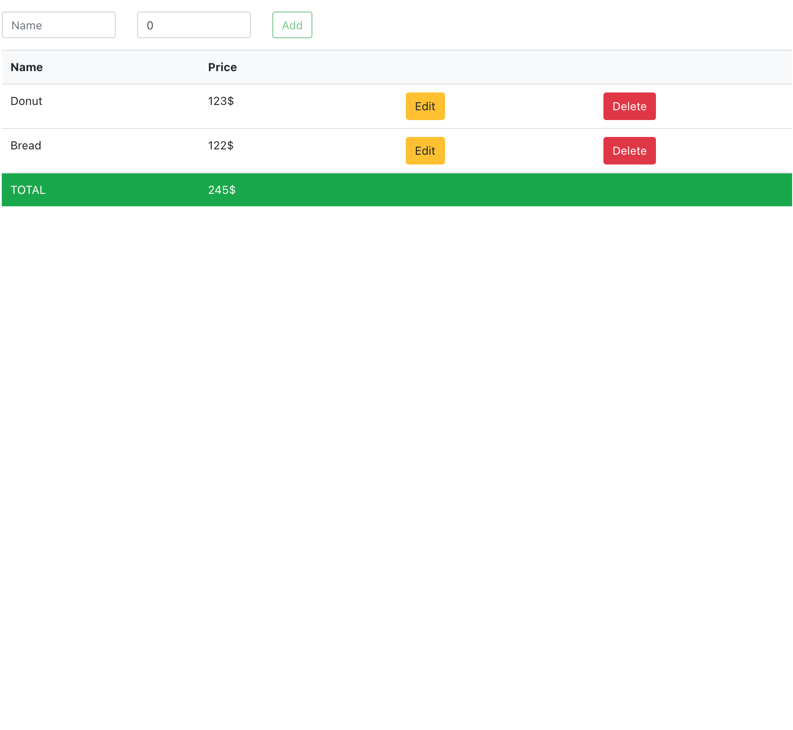
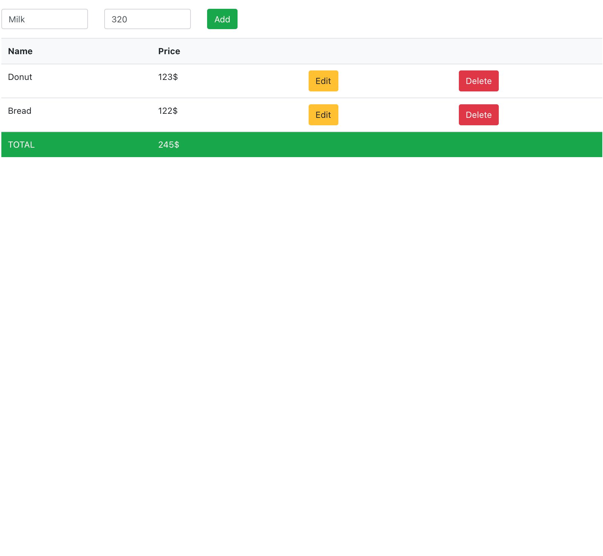
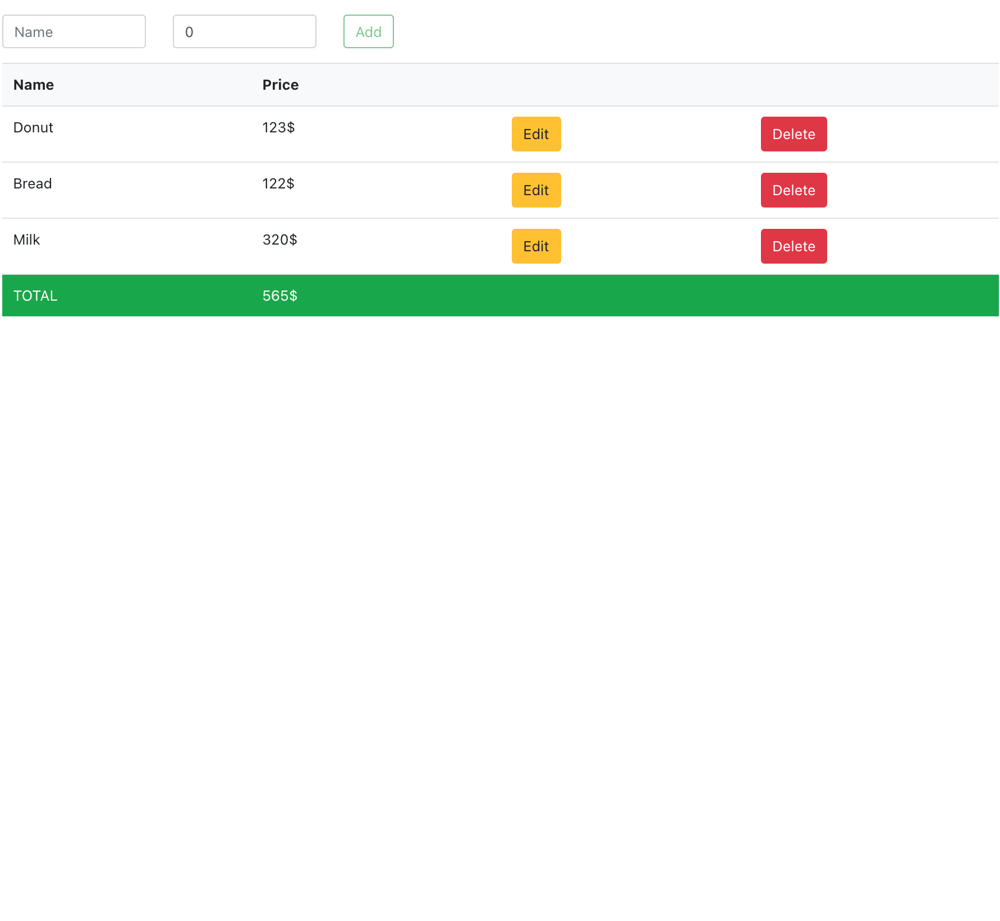
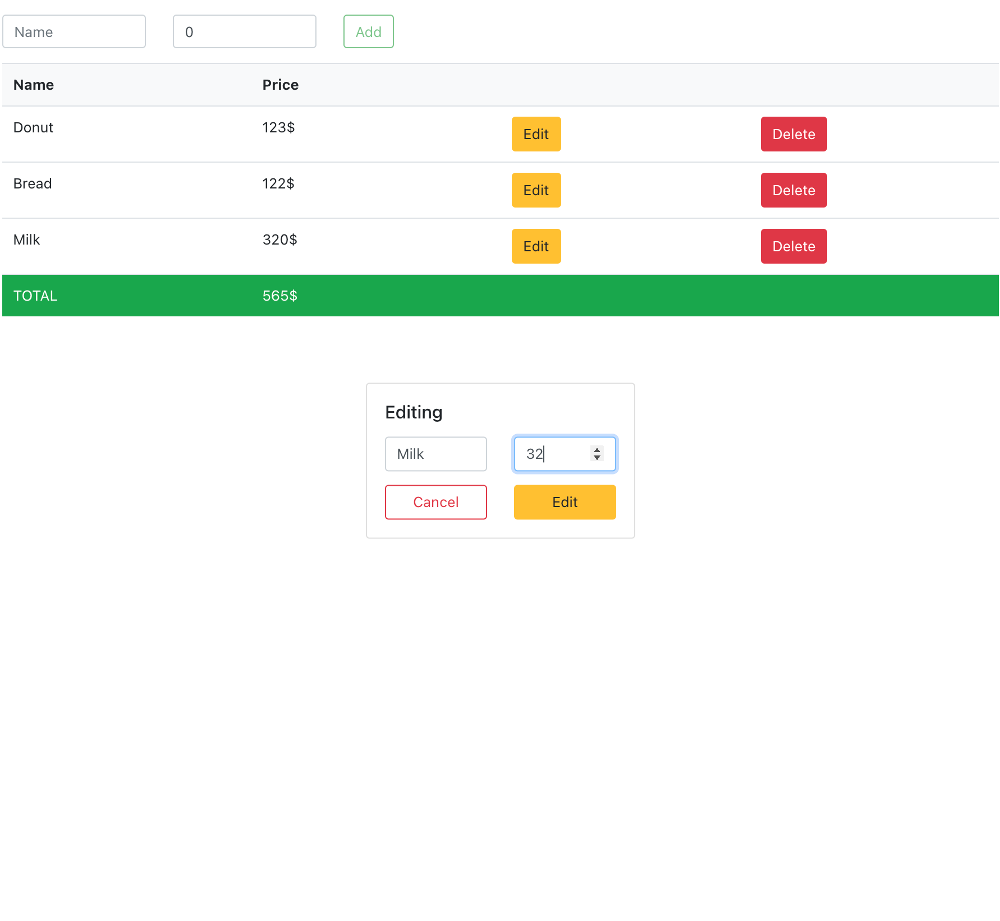
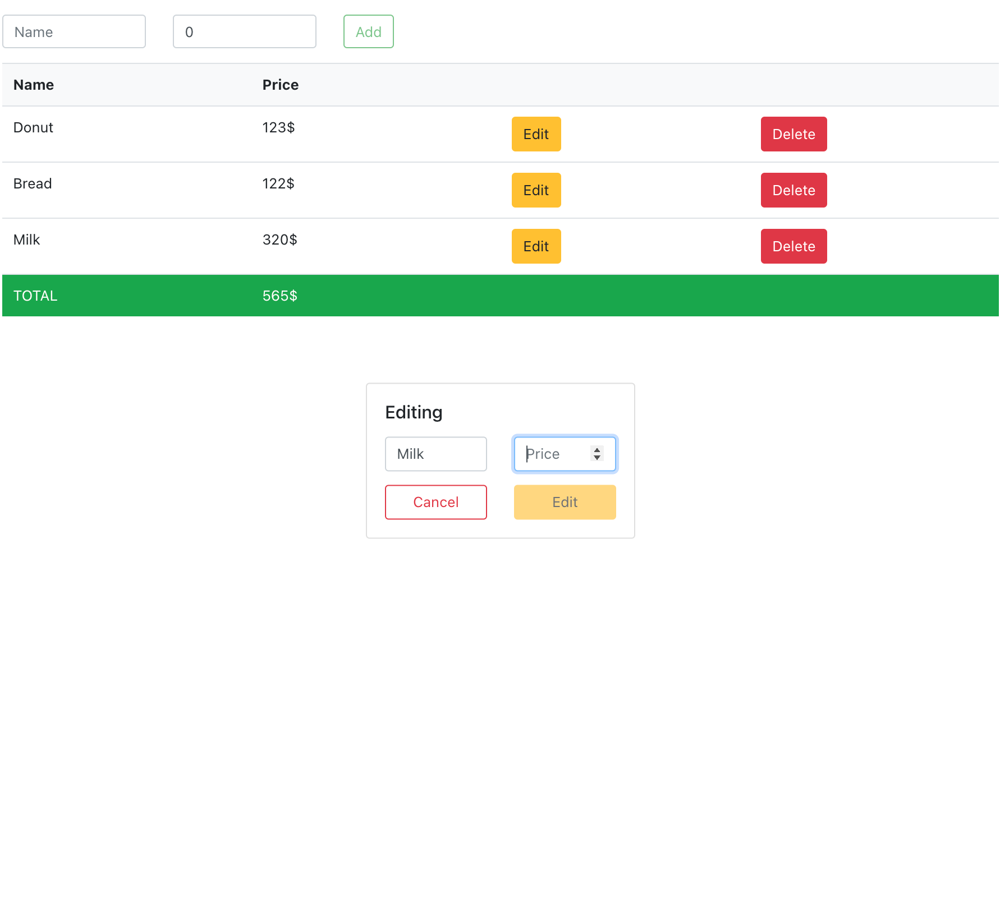
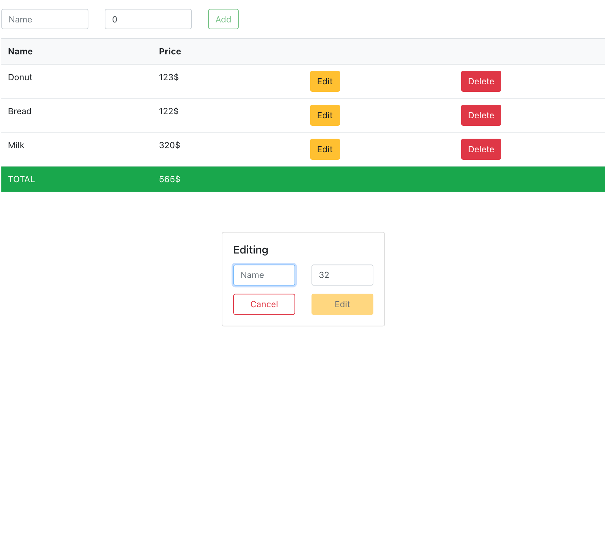
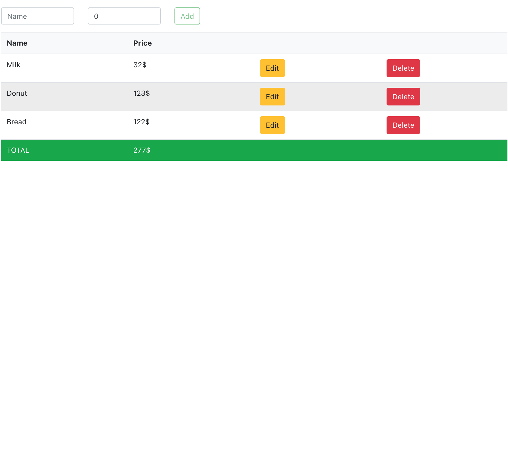
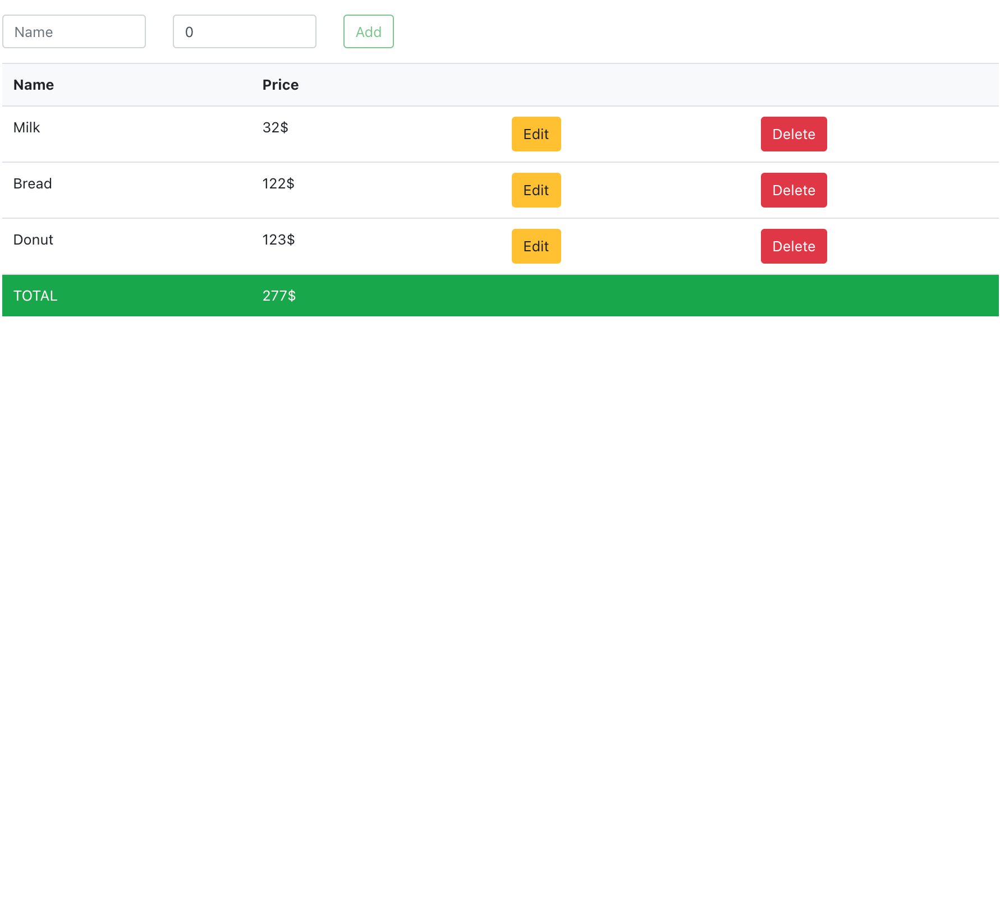

# alphabank_task_2
Второе тестовое задание на стажировку в Альфа-банк

Для установки всех зависимостей `npm install`  

### Само задание:  
Необходимо реализовать одностраничное веб-приложение (без бэкэнда) помогающее составлять список покупок. Сверху находится форма, где пользователь вводит название и цену товара. У пользователя не должно быть возможности добавить в список товар без имени, без цены или с ценой не являющейся числом. Ниже формы находится таблица с товарами и ценами. У таблицы есть заголовок с именами столбцов (name, price) и подвал, в котором отображается актуальная суммарная стоимость всех товаров. У каждого элемента таблицы есть 2 кнопки - редактирование и удаление товара в списке. Функционал редактирования необходимо реализовать используя модальное окно. Таблица должна иметь сортировку по обеим колонкам.
Реализовать приложение необходимо на языке Javascript (или Typescript) в архитектуре React Redux. Можно использовать любой удобный UI kit, инструменты сборки.

### Основной вид, в начале есть два продукта

### Добавление продукта
Добавление без имени или без цены не возможно, блокируется кнопка.

### Продукт добавлен

### Изменение продукта

### Изменения без цены - невозможно
При удалении цены блокируется кнопка

### Изменения без имени - невозможно
При удалении цены блокируется кнопка

### Сортировка по названию в прямом порядке

### Сортировка по названию в обратном порядке

### Сортировка по цене от меньшего к большему

### Сортировка по цене от большего к меньшему

